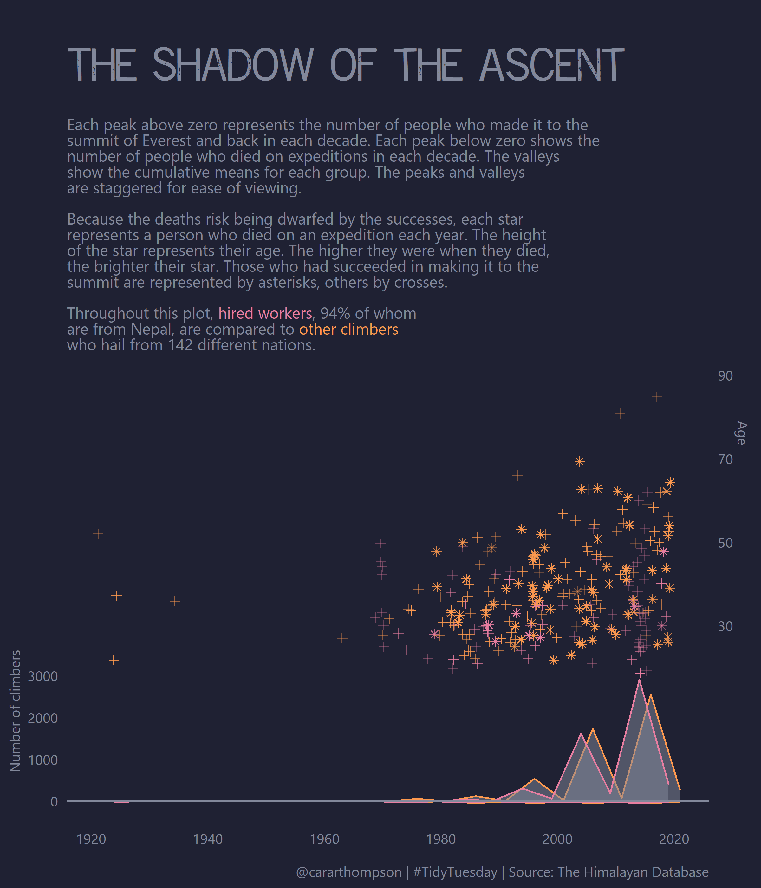
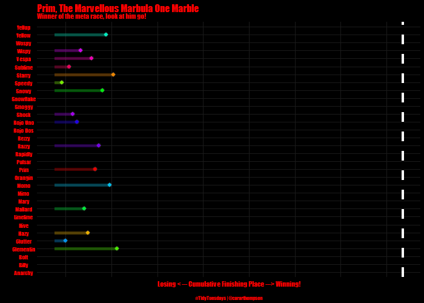

```{r setup, include=FALSE}
knitr::opts_chunk$set(echo = F)
```

Welcome to my #TidyTuesday repo. Clicking on a plot will take you to the code I wrote to build it. Happy browsing, and if you like what you see, [get in touch](https://twitter.com/cararthompson)! 

## What is #TidyTuesday?
From the organisers:

> Join the R4DS Online Learning Community in the weekly #TidyTuesday event! Every week we post a raw dataset, a chart or article related to that dataset, and ask you to explore the data. While the dataset will be "tamed", it will not always be tidy! As such you might need to apply various R for Data Science techniques to wrangle the data into a true tidy format. The goal of TidyTuesday is to apply your R skills, get feedback, explore other's work, and connect with the greater #RStats community! As such we encourage everyone of all skills to participate!

[Find out more](https://github.com/rfordatascience/tidytuesday/blob/master/README.md),  [see what others are doing](https://twitter.com/hashtag/TidyTuesday?src=hashtag_click), and join in - the more the merrier!

## 2021-01 - W.E.B. DuBois Challenge

<a href='scripts/202102_webdubois.R' target='_blank'></a>


## 2021-01 - Art

<a href='scripts/202101_art.R' target='_blank'></a>


## 2020-12 - Christmas

<a href='scripts/202012_christmasCard.R' target='_blank'></a>


## 2020-12 - Big Mac

<a href='scripts/202012_bigmac.R' target='_blank'></a>


## 2020-11 - Phones

<a href='scripts/202011_phones.R' target='_blank'></a>

## 2020-10 - Everest

<a href='scripts/202010_everest.R' target='_blank'></a>


## 2020-09 - Crops

<a href='scripts/202009_crops.R' target='_blank'></a>


## 2020-08 - Avatar

<a href='scripts/202008_avatar.R' target='_blank'></a>


## 2020-07 - Penguins

<a href='scripts/202007d_penguins.R' target='_blank'></a>


## 2020-07 - Animals and Pets

<a href='scripts/202007c_pets.R' target='_blank'></a>


## 2020-07 - Astronauts

<a href='scripts/202007b_astronauts.R' target='_blank'></a>


## 2020-07 - Coffee

<a href='scripts/202007_coffee.R' target='_blank'></a>


## 2020-06 - Caribou

<a href='scripts/202006b_caribou.R' target='_blank'></a>


## 2020-06 - Marbles

<a href='scripts/202006_marbles.R' target='_blank'></a>
<a href='scripts/202006_marbles.R' target='_blank'></a>


## 2020-05 - Volcanoes

<a href='scripts/202005_volcanoes.R' target='_blank'></a>


